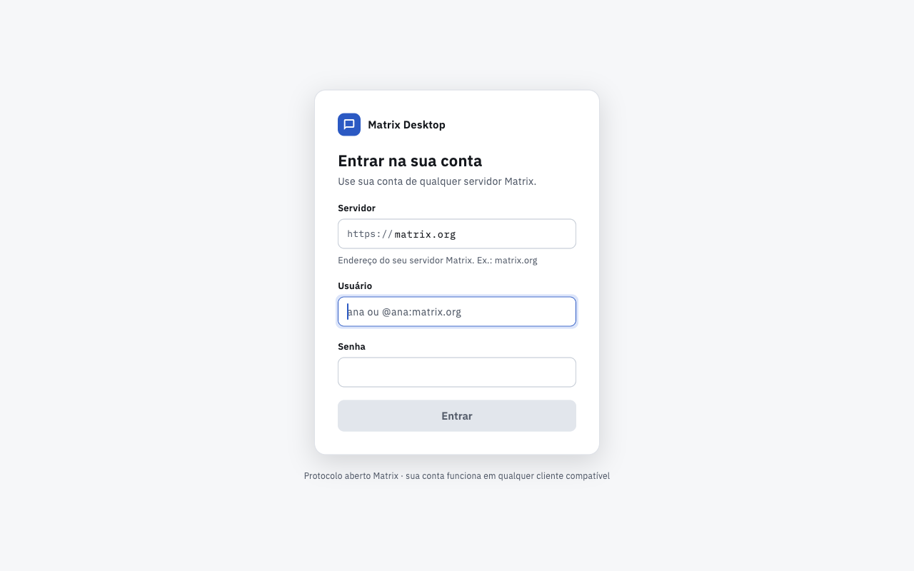
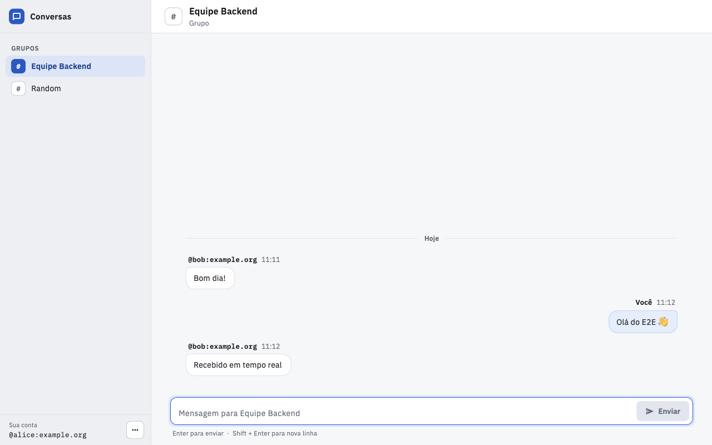
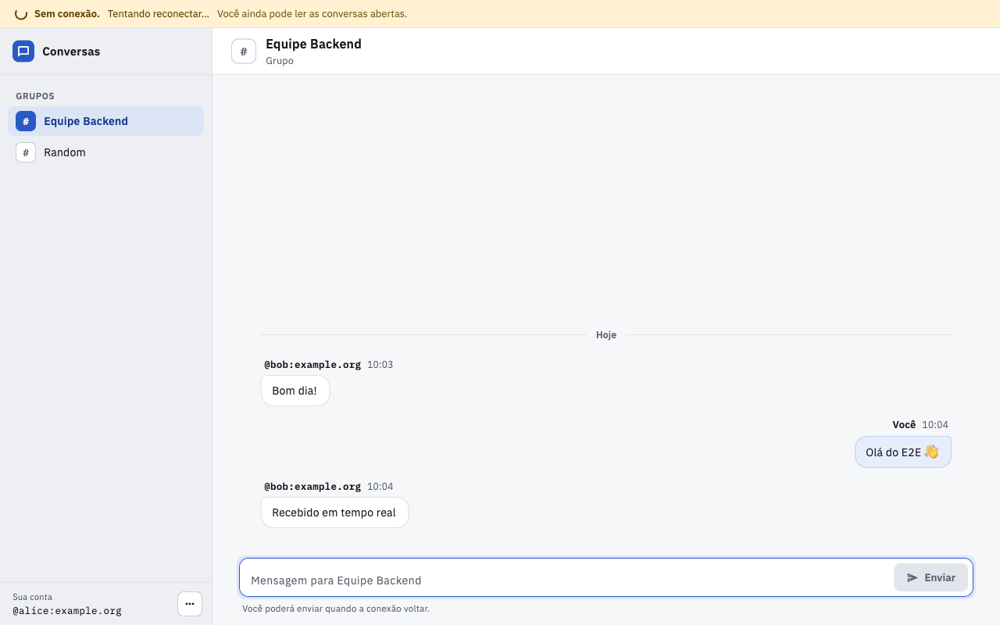
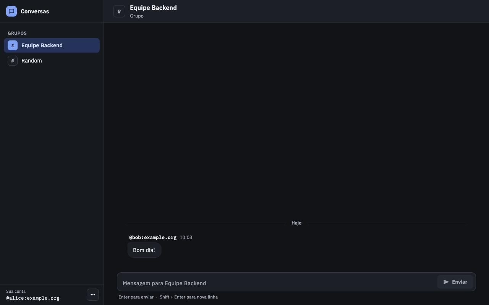

# Insight Lab

Cliente desktop de mensageria [Matrix](https://matrix.org): Flutter na
interface, Rust (Matrix Rust SDK) no núcleo, ligados pelo Flutter Rust Bridge.
Alvo: macOS, Windows e Linux.

Permite entrar em qualquer homeserver Matrix (usuário e senha), ver as salas,
abrir uma conversa, ler e enviar mensagens de texto, receber mensagens em
tempo real, fechar e reabrir o app com a sessão restaurada, e sair.

| Login | Conversa |
|---|---|
|  |  |

| Sem conexão (dados preservados) | Tema escuro (segue o sistema) |
|---|---|
|  |  |

*Capturas reais do app, geradas pelo teste E2E contra um homeserver local de teste.*

## Arquitetura

```text
Flutter UI (lib/ui)                 telas: login, salas, conversa
        ↓  observa estado, chama intents
Riverpod state layer (lib/app)      sessão, salas, conversa, reconciliação
        ↓
MessengerGateway                    interface 1:1, permite testes
        ↓
Flutter Rust Bridge (rust/bridge)   API Dart tipada + Stream<CoreEvent>
        ↓
MessengerCore (rust/src)            login, sessão, salas, mensagens, sync
        ↓
Matrix Rust SDK                     protocolo, criptografia, store SQLite
```

- **Matrix fica no Rust:** o SDK oficial (criptografia, sync, store) é Rust;
  o core o encapsula e expõe só tipos simples e erros semânticos.
- **Flutter não conhece o SDK:** a UI e o state layer só veem
  `RoomSummary`, `Message`, `CoreEvent`, `ApiError`. Segredos (token, chave
  do store) nunca atravessam a bridge.
- **Realtime por stream:** um sync contínuo no Rust emite eventos
  (`MessageReceived`, `RoomsChanged`, `TimelineGap`, `SyncStateChanged`,
  `SessionRevoked`, `EventsLost`) para um único `Stream` no Dart.
- **Estado de aplicação no Flutter:** fases do app, seleção de sala,
  timeline exibida e reconciliação são decisões de produto, testadas sem UI.

## Estrutura

```text
rust/                    workspace Cargo
├── src/                 messenger_core — engine Matrix
└── bridge/              messenger_bridge — adaptador FRB (sem regra de negócio)
flutter/                 app Flutter desktop (messenger_app)
├── lib/main.dart        composition root
├── lib/app/             state layer (Riverpod)
├── lib/ui/              telas (alta fidelidade)
├── lib/src/rust/        bindings GERADOS — não editar
├── hook/build.dart      build hook (Native Assets) que compila rust/bridge
├── assets/fonts/        IBM Plex Sans/Mono (OFL, licença incluída)
├── test/                testes Dart (VM): bridge, state layer, UI
└── integration_test/    testes dentro do app desktop real (bridge + E2E pela UI)
docs/screenshots/        capturas do app
```

## Pré-requisitos

| | macOS | Windows | Linux |
|---|---|---|---|
| Rust | [rustup](https://rustup.rs) | rustup (toolchain MSVC) | rustup |
| Flutter | stable ≥ 3.47 (Dart ≥ 3.13) | idem | idem |
| Toolchain nativo | Xcode + CocoaPods | Visual Studio 2022, "Desktop development with C++" | `clang cmake ninja-build pkg-config libgtk-3-dev` |
| Cofre de credenciais | Keychain (nativo) | Credential Manager (nativo) | Secret Service em execução (gnome-keyring, KWallet) |

O toolchain Rust usado pelo build (`1.99.0`, fixado em
`rust/bridge/rust-toolchain.toml`) é instalado automaticamente pelo rustup.

Codegen do Flutter Rust Bridge (mesma versão do crate e do pacote Dart):

```bash
cargo install flutter_rust_bridge_codegen --version 2.13.0 --locked
```

## Rodar

```bash
git clone <repo> && cd Desafio-Tecnico-Insight-Lab/flutter
flutter pub get
flutter run -d macos        # ou: -d windows / -d linux
```

O build hook compila o crate Rust (release) e empacota a biblioteca no app,
sem passos manuais. O primeiro build compila o Matrix SDK e leva alguns
minutos. O homeserver é informado na tela de login (ex.: `matrix.org`;
`http://localhost:8008` para um servidor local).

Para testar, crie as salas no Element com a criptografia ponta a ponta **desativada**: o app não
tem backup de chaves, então em salas criptografadas só aparecem mensagens posteriores ao login atual.

Build de distribuição: `flutter build macos --release` (ou `windows` / `linux`).

No Linux, para o app aparecer no menu e no dock com o ícone, rode
`linux/packaging/install-desktop-entry.sh` (dentro de `flutter/`) após o build release.

Ícones do app (macOS, Windows, Linux) são gerados a partir dos SVGs em
`flutter/tool/icon/` (direção B do design): `python3 tool/icon/generate.py`
dentro de `flutter/` (requer Google Chrome e Pillow). Os arquivos gerados já
estão versionados.

Os bindings já estão versionados. Só é preciso regenerá-los ao mudar a API em
`rust/bridge/src/api/`:

```bash
cd flutter && flutter_rust_bridge_codegen generate
```

## Testes

Nenhum teste padrão usa internet nem o cofre de credenciais do usuário: eles
usam um homeserver Matrix falso local e um cofre em memória.

```bash
cd rust
cargo test --workspace                                   # core + bridge
cargo fmt --all --check
cargo clippy --workspace --all-targets -- -D warnings
cargo build -p messenger_bridge                          # biblioteca usada por flutter test

cd ../flutter
flutter analyze
flutter test                                             # bridge, state layer, UI
flutter test integration_test -d macos                   # app real: smoke + E2E pela UI
```

O E2E (`integration_test/app_e2e.dart`) roda o app inteiro pela interface, com
o motor Rust real e o Keychain real: login com erro e com sucesso, salas,
histórico, envio, mensagem em tempo real, queda e volta da conexão, fechar e
reabrir com a sessão restaurada, logout, nova sessão revogada pelo servidor.
Durante o E2E, a janela do app precisa ficar visível (tela desbloqueada, sem
outro app em tela cheia por cima): o macOS não entrega quadros a uma janela
coberta e o teste, que avança quadro a quadro, fica parado.

Testes manuais opcionais (ignorados por padrão):

```bash
# cofre de credenciais real do sistema (grava e apaga um item de teste)
cargo test -p messenger_core system_secret_store -- --ignored
# homeserver real (nunca versione credenciais)
MATRIX_HOMESERVER=https://matrix.org MATRIX_USERNAME=... MATRIX_PASSWORD=... \
  cargo test -p messenger_core --test live_login -- --ignored --nocapture
```

Detalhes por camada: [rust/README.md](rust/README.md) e [flutter/README.md](flutter/README.md).
